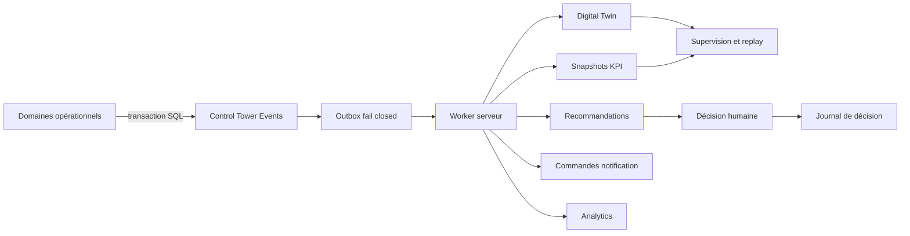

# Global Operations Control Tower

Date de validation interne : 22 juillet 2026  
Périmètre : Admin App, services partagés et projet Supabase Yobalelma `rgcgtcycbiuhcaoaadbh`.

## Verdict

La fondation interne du Control Tower est implémentée et vérifiée : architecture modulaire, bus d'événements idempotent, outbox, Digital Twin, replay, recommandations explicables, incidents, vues par rôle et carte sur coordonnées réelles.

Le Control Tower n'est pas déclaré prêt pour une exploitation nationale ou internationale. L'activation du worker permanent, le fournisseur cartographique officiel, les canaux de notification, les intégrations partenaires, les tests de charge distribués et une validation E2E authentifiée en production restent obligatoires.

## Architecture

Les 16 modules sont enregistrés dans `lib/control-tower/modules.ts` et possèdent un graphe de dépendances validé par test : Core, Operations, Dispatch, Fleet, Driver Tracking, Hubs, Relays, Shipments, Incidents, Notifications, Executive, Partners, Analytics, Recommendations, Digital Twin, Audit.

Le bus reçoit automatiquement les changements réels de `shipments`, `local_delivery_missions`, `driver_operational_states`, `operational_incidents`, `payments`, `customs_cases`, `airport_hubs` et `relay_points`. Les payloads sont volontairement limités à des données opérationnelles nettoyées. L'unicité `(source_module, source_event_id)` et l'outbox rendent la consommation idempotente.

## Modèle de données

| Objet | Responsabilité | Protection |
|---|---|---|
| `control_tower_events` | journal canonique et replay | lecture RBAC/pays, écriture service/trigger |
| `control_tower_outbox` | file transactionnelle | politique explicite `false`, service uniquement |
| `digital_twin_entities` | état courant des actifs | RBAC/pays |
| `digital_twin_state_events` | versions immuables du jumeau | RBAC/pays |
| `control_tower_snapshots` | KPI par pays et minute | RBAC/pays |
| `control_tower_recommendations` | aide à la décision expliquée | RBAC/pays, validation humaine |
| `control_tower_decision_events` | audit des décisions | RBAC/pays |
| `control_tower_module_health` | disponibilité, latence et backlog | RBAC/pays |
| `control_tower_notification_commands` | commandes nettoyées multicanal | RBAC/pays |
| `operational_incident_comments` | chronologie collaborative | périmètre incident/pays |

Migrations :

- `20260722058000_global_operations_control_tower.sql`
- `20260722059000_control_tower_workers.sql`
- `20260722060000_control_tower_domain_events.sql`
- `20260722061000_control_tower_outbox_fail_closed.sql`
- `20260722062000_control_tower_payload_allowlist.sql`

## Interfaces serveur

| RPC | Appelant | Usage |
|---|---|---|
| `ingest_control_tower_events` | service | ingestion batch 1 à 500 |
| `claim_control_tower_outbox` | service | bail avec `skip locked` |
| `process_control_tower_outbox_item` | service | Digital Twin, snapshot, recommandation, notification |
| `complete_control_tower_outbox` | service | succès, retry exponentiel ou dead letter |
| `refresh_control_tower_snapshot` | service | agrégats par pays |
| `generate_control_tower_recommendations` | service | recommandations déterministes |
| `decide_control_tower_recommendation` | utilisateur autorisé | accuser, approuver ou rejeter avec motif |
| `manage_control_tower_incident` | manager autorisé | assigner, commenter et faire progresser le workflow |
| `purge_control_tower_history` | service | politique de rétention |

Le worker `scripts/control-tower-worker.mjs` ne journalise aucune clé ni aucun payload sensible. Il réclame un lot, vérifie le statut final de chaque item et publie la santé des modules. Il doit être déployé dans un runtime privé avec une seule clé service et une fréquence définie par l'exploitation.

## Expérience opérateur

La route principale `/command` ouvre le Control Tower pour les rôles autorisés. `/command/control-tower` reste disponible explicitement.

- KPI réseau lisibles en moins de dix signaux ;
- priorisation par impact opérationnel ;
- carte avec coordonnées réelles, recherche, couches, regroupement spatial, zoom et sélection ;
- vues Direction, Finance, Support, Partenaires, Douanes, Dispatch et Exploitation limitées selon le rôle ;
- filtrage pays limité aux affectations ;
- replay déterministe et filtrable par période côté serveur ;
- recommandations avec preuve, confiance, alternatives et validation humaine ;
- aucune donnée fictive utilisée pour remplir un état vide.

Sans fournisseur cartographique, une grille latitude/longitude reste fonctionnelle. Elle ne prétend pas fournir de fond routier, de trafic ou d'ETA.

## Sécurité

- RLS active sur les 111 tables contrôlées ; aucune table contrôlée sans politique ;
- RPC du worker `security definer`, exécutables uniquement par `service_role` ;
- outbox invisible et non modifiable par `anon` et `authenticated` ;
- payloads d'ingestion réduits en base et en TypeScript à une liste blanche opérationnelle ;
- données de géolocalisation filtrées par rôle, mission et pays via les politiques de tracking existantes ;
- transitions d'incident contraintes par une machine d'état ;
- assignee d'un incident vérifié dans le pays concerné ;
- recommandations sensibles toujours soumises à validation humaine et motif ;
- aucun secret ajouté au dépôt.

## Performance mesurée

Benchmark local reproductible : `node scripts/control-tower-load.mjs 250000`.

| Mesure | Résultat |
|---|---:|
| événements rejoués | 250 000 |
| durée | 581,61 ms |
| débit | 429 841 événements/s |
| mémoire additionnelle mesurée | 32 Mo |
| test unitaire 50 000 événements | 729 ms |

Cette mesure valide l'algorithme de replay en mémoire sur la machine de développement. Elle ne remplace pas un test de charge distribué du réseau, de Postgres, du worker et de l'interface en production.

## Preuves de validation

- TypeScript strict : réussi.
- Suite globale : 246/246 tests réussis sur 44 fichiers.
- Tests ciblés Control Tower, dispatch, géolocalisation et tracking : réussis, y compris charge locale, retry/dead-letter et filtrage des payloads.
- Schéma distant : 111 tables contrôlées, 0 échec.
- Audit distant RLS/fonctions : `ok: true`, 0 fonction manquante, 0 politique manquante, 0 RPC service exposée aux clients.
- Migration distante : 62 migrations contrôlées, aucune migration Control Tower en attente au moment de la validation.
- Builds production : socle Next.js et Admin App réussis ; route dynamique `/command/[[...segments]]` compilée.

Les validations globales lint, tests et builds sont consignées à nouveau à la fin de la phase. Une capture authentifiée ne peut être produite honnêtement sans session pilote autorisée ; aucun contournement d'authentification n'est introduit pour une démonstration.

Preuve visuelle du garde d'accès local : `docs/evidence/control-tower-auth-guard-2026-07-22.png`. La capture des vues métier derrière MFA reste en attente d'une session pilote autorisée.

## Dépendances externes restant à activer

| Dépendance | État | Activation requise |
|---|---|---|
| runtime worker permanent | non déployé | hébergement privé, planification, alerting et clé service |
| cartographie/routage/trafic | non fourni | contrat, URL gateway, token serveur et clé navigateur restreinte |
| push/e-mail/SMS | adaptateurs préparés, accès absent | comptes fournisseurs, domaines et webhooks officiels |
| WhatsApp | désactivé | accès Business officiel et modèles approuvés |
| Orange Money | production bloquée | identifiants et homologation officiels |
| douanes | mode contrôlé manuel | API/mandat officiel par pays |
| observabilité externe | non connectée | destination logs, métriques, alertes et astreinte |
| tests E2E production | non exécutés | comptes pilotes, session MFA et fenêtre de test |
| charge distribuée | non exécutée | environnement de préproduction représentatif et objectifs SLO |

## Critères de passage en exploitation

1. Déployer le worker, prouver les retries, la dead-letter et les alertes.
2. Activer un fournisseur cartographique contractuel et valider trafic/ETA sur les pays ciblés.
3. Exécuter les scénarios authentifiés par rôle et par pays, y compris routes interdites.
4. Tester une perte réseau, un GPS indisponible, une saturation hub, une réaffectation et une panne fournisseur sur préproduction.
5. Exécuter une charge distribuée avec volumétrie cible, SLO, p95/p99, base et worker.
6. Connecter l'observabilité et valider l'astreinte, les runbooks et la reprise.
7. Réaliser la recette métier avec exploitation, finance, douanes, support et partenaires.

## Statut par bloc

| Bloc | Statut |
|---|---|
| architecture et modèle | validé en code et base |
| événements et Digital Twin | validé techniquement, worker permanent requis |
| dispatch explicable | fondation validée, trafic externe requis |
| incidents | workflow serveur validé, recette opérateur requise |
| replay | validé en test local |
| RBAC/RLS | audit distant réussi |
| carte | interactions réelles validées en code, fond officiel requis |
| notifications partenaires | préparées, accès externes requis |
| production nationale | non validée |
| production internationale | non validée |
